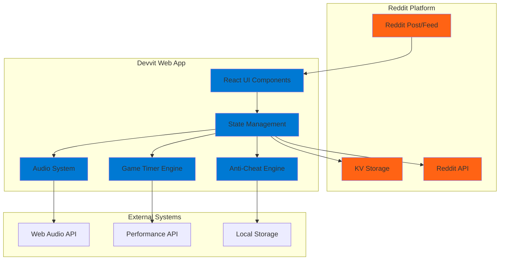
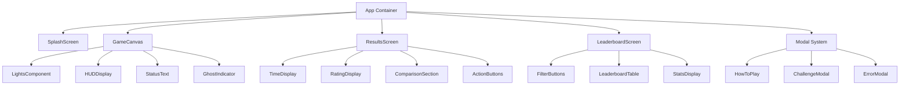
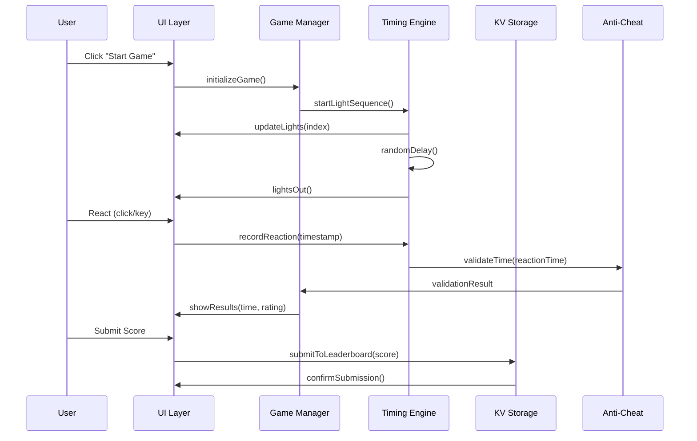

# F1 Start Challenge - Design Document

## Overview

The F1 Start Challenge is architected as a modern web application built on Reddit's Devvit Web platform, delivering an authentic 1982 arcade experience with contemporary social features. The design prioritizes millisecond-precision timing, authentic visual aesthetics, and innovative pseudo-synchronous multiplayer within platform constraints.

The system employs a component-based React architecture with centralized state management, Reddit KV storage for persistence, and Web Audio API for authentic sound effects. The design ensures 60fps performance, sub-16ms input latency, and comprehensive accessibility support across all devices.

## Architecture

### High-Level System Architecture



### Component Architecture



### Data Flow Architecture



## Components and Interfaces

### Core Game Engine

#### GameManager Class

```typescript
interface GameManager {
  // State Management
  currentState: GameState;
  gameConfig: GameConfiguration;
  userSession: UserSession;

  // Core Methods
  initializeGame(): Promise<void>;
  startGameSequence(): Promise<void>;
  handleUserInput(event: InputEvent): void;
  processResults(reactionTime: number): GameResult;

  // State Transitions
  transitionToState(newState: GameState): void;
  resetGame(): void;
}

interface GameConfiguration {
  lightInterval: number; // 900ms default
  minRandomDelay: number; // 500ms
  maxRandomDelay: number; // 2500ms
  difficultyMode: 'easy' | 'normal' | 'hard' | 'pro';
}

interface GameResult {
  reactionTime: number;
  rating: 'perfect' | 'excellent' | 'good' | 'fair' | 'slow' | 'false_start';
  driverComparison: DriverComparison;
  communityPercentile: number;
  isPersonalBest: boolean;
}
```

#### TimingEngine Class

```typescript
interface TimingEngine {
  // High-Precision Timing
  startSequence(config: GameConfiguration): Promise<number>;
  recordReaction(): number;
  getCurrentTime(): number; // performance.now() wrapper

  // Light Sequence Control
  activateLight(index: number): void;
  deactivateAllLights(): void;
  isSequenceActive(): boolean;

  // Deterministic Seeding (for challenges)
  setSeed(seed: number): void;
  generateDeterministicDelay(): number;
}

interface LightState {
  index: number;
  isActive: boolean;
  activatedAt: number;
}
```

### User Interface Components

#### LightsComponent

```typescript
interface LightsComponentProps {
  lights: LightState[];
  onUserInput: (timestamp: number) => void;
  isInputEnabled: boolean;
  ghostIndicator?: GhostIndicator;
}

interface LightStyle {
  size: 'desktop' | 'mobile'; // 80px vs 50px
  glowIntensity: number;
  animationDuration: number; // 50ms transition
}
```

#### ResultsScreen Component

```typescript
interface ResultsScreenProps {
  result: GameResult;
  onPlayAgain: () => void;
  onSubmitScore: () => void;
  onCreateChallenge: () => void;
  onBackToMenu: () => void;
}

interface TimeDisplayProps {
  time: number; // milliseconds
  unit: 'ms' | 'sec';
  size: 'hero' | 'normal';
  color: 'yellow' | 'gold' | 'white' | 'red';
}
```

### Data Management Interfaces

#### LeaderboardService

```typescript
interface LeaderboardService {
  // Data Retrieval
  getLeaderboard(scope: LeaderboardScope, filter: TimeFilter): Promise<LeaderboardEntry[]>;
  getUserRank(userId: string, scope: LeaderboardScope): Promise<number | null>;

  // Data Submission
  submitScore(entry: LeaderboardEntry): Promise<SubmissionResult>;
  validateSubmission(entry: LeaderboardEntry): ValidationResult;

  // Scope Management
  getCurrentScope(): LeaderboardScope;
  setScope(scope: LeaderboardScope): void;
}

interface LeaderboardEntry {
  userId: string;
  username: string;
  reactionTime: number; // milliseconds
  timestamp: string; // ISO 8601
  scope: LeaderboardScope;
  period: TimeFilter;
  flagged: boolean;
}

type LeaderboardScope = 'global' | `r/${string}`;
type TimeFilter = 'daily' | 'weekly' | 'alltime';
```

#### ChallengeService

```typescript
interface ChallengeService {
  // Challenge Creation
  createChallenge(creatorData: ChallengeCreatorData): Promise<Challenge>;
  generateChallengeUrl(challengeId: string): string;

  // Challenge Participation
  loadChallenge(challengeId: string): Promise<Challenge | null>;
  acceptChallenge(challengeId: string): Promise<ChallengeSession>;
  submitChallengeResult(session: ChallengeSession, result: GameResult): Promise<ChallengeResult>;
}

interface Challenge {
  id: string;
  creator: string;
  creatorTime: number;
  seed: number; // For deterministic timing
  createdAt: string;
  expiresAt: string;
  acceptedBy: ChallengeAttempt[];
}

interface ChallengeSession {
  challenge: Challenge;
  seed: number;
  ghostTiming: number;
  isActive: boolean;
}
```

## Data Models

### Core Game Data

#### User Session Model

```typescript
interface UserSession {
  userId: string;
  username: string;
  sessionStart: number;
  personalBest: number | null;
  sessionStats: SessionStatistics;
  preferences: UserPreferences;
}

interface SessionStatistics {
  gamesPlayed: number;
  averageTime: number;
  falseStarts: number;
  perfectScores: number;
  improvementRate: number;
}

interface UserPreferences {
  audioEnabled: boolean;
  difficultyMode: string;
  preferredScope: LeaderboardScope;
  accessibilityMode: boolean;
}
```

#### Driver Comparison Model

```typescript
interface DriverDatabase {
  drivers: F1Driver[];
  lastUpdated: string;
}

interface F1Driver {
  id: string;
  name: string;
  team: string;
  avgReactionTime: number; // milliseconds
  consistency: number; // 0-1 scale
  championships: number;
  isActive: boolean;
}

interface DriverComparison {
  userTime: number;
  fasterThan: F1Driver[];
  slowerThan: F1Driver[];
  message: string;
  icon: string;
  color: string;
}
```

### Storage Schema

#### KV Storage Structure

```typescript
// Leaderboard Keys: leaderboard:{scope}:{period}:{userId}
interface LeaderboardRecord {
  time: number;
  username: string;
  submitted: number;
  flagged: boolean;
}

// Challenge Keys: challenge:{challengeId}
interface ChallengeRecord {
  creator: string;
  creatorTime: number;
  seed: number;
  created: number;
  expires: number;
  attempts: ChallengeAttempt[];
}

// User Keys: user:{userId}
interface UserRecord {
  username: string;
  personalBest: number;
  totalGames: number;
  joinedAt: number;
  lastActive: number;
}

// Rate Limit Keys: ratelimit:{userId}
interface RateLimitRecord {
  minute: number[];
  hour: number[];
  day: number[];
}
```

## Error Handling

### Error Classification System

```typescript
enum ErrorType {
  // Network Errors
  NETWORK_UNAVAILABLE = 'NETWORK_UNAVAILABLE',
  KV_STORAGE_ERROR = 'KV_STORAGE_ERROR',
  API_RATE_LIMITED = 'API_RATE_LIMITED',

  // Game Errors
  TIMING_PRECISION_LOW = 'TIMING_PRECISION_LOW',
  AUDIO_CONTEXT_FAILED = 'AUDIO_CONTEXT_FAILED',
  PERFORMANCE_DEGRADED = 'PERFORMANCE_DEGRADED',

  // User Errors
  INVALID_INPUT = 'INVALID_INPUT',
  SUBMISSION_REJECTED = 'SUBMISSION_REJECTED',
  CHALLENGE_EXPIRED = 'CHALLENGE_EXPIRED',

  // System Errors
  BROWSER_INCOMPATIBLE = 'BROWSER_INCOMPATIBLE',
  MEMORY_EXCEEDED = 'MEMORY_EXCEEDED',
  SECURITY_VIOLATION = 'SECURITY_VIOLATION',
}

interface ErrorHandler {
  handleError(error: GameError): ErrorResponse;
  showErrorModal(error: GameError): void;
  logError(error: GameError): void;
  recoverFromError(error: GameError): Promise<boolean>;
}

interface GameError {
  type: ErrorType;
  message: string;
  context: any;
  timestamp: number;
  recoverable: boolean;
}
```

### Fallback Strategies

```typescript
interface FallbackStrategy {
  // Storage Fallbacks
  useLocalStorageForScores(): void;
  enableOfflineMode(): void;

  // Performance Fallbacks
  reduceAnimationQuality(): void;
  disableAudioEffects(): void;
  simplifyVisualEffects(): void;

  // Timing Fallbacks
  useReducedPrecision(): void;
  roundToNearestTen(): void;
}
```

## Testing Strategy

### Unit Testing Approach

#### Core Game Logic Tests

```typescript
describe('TimingEngine', () => {
  test('should measure reaction time with millisecond precision', () => {
    const engine = new TimingEngine();
    const startTime = engine.startReactionTimer();
    // Simulate 186ms delay
    const reactionTime = engine.recordReaction(startTime + 186);
    expect(reactionTime).toBe(186);
  });

  test('should detect false starts correctly', () => {
    const engine = new TimingEngine();
    engine.startLightSequence();
    const earlyInput = engine.recordReaction(); // Before lights out
    expect(earlyInput.type).toBe('FALSE_START');
  });

  test('should generate deterministic delays with same seed', () => {
    const engine1 = new TimingEngine();
    const engine2 = new TimingEngine();
    const seed = 12345;

    engine1.setSeed(seed);
    engine2.setSeed(seed);

    expect(engine1.generateDelay()).toBe(engine2.generateDelay());
  });
});
```

#### Anti-Cheat System Tests

```typescript
describe('AntiCheatEngine', () => {
  test('should flag impossibly fast times', () => {
    const antiCheat = new AntiCheatEngine();
    const result = antiCheat.validateTime(50); // 50ms - impossible
    expect(result.flagged).toBe(true);
    expect(result.reason).toBe('IMPOSSIBLY_FAST');
  });

  test('should detect statistical outliers', () => {
    const antiCheat = new AntiCheatEngine();
    const userHistory = [200, 210, 205, 195, 208]; // Consistent times
    const outlier = antiCheat.checkOutlier(50, userHistory); // Sudden improvement
    expect(outlier.isOutlier).toBe(true);
  });
});
```

### Integration Testing

#### End-to-End Game Flow

```typescript
describe('Complete Game Flow', () => {
  test('should complete full game cycle successfully', async () => {
    const game = new GameManager();

    // Initialize game
    await game.initializeGame();
    expect(game.currentState).toBe('SPLASH');

    // Start game sequence
    game.startGameSequence();
    expect(game.currentState).toBe('READY');

    // Simulate light sequence completion
    await game.waitForLightsOut();
    expect(game.currentState).toBe('WAITING_FOR_INPUT');

    // Simulate user reaction
    const reactionTime = game.handleUserInput();
    expect(reactionTime).toBeGreaterThan(0);
    expect(game.currentState).toBe('SHOWING_RESULTS');
  });
});
```

### Performance Testing

#### Timing Precision Validation

```typescript
describe('Performance Requirements', () => {
  test('should maintain 60fps during light sequence', async () => {
    const monitor = new PerformanceMonitor();
    const game = new GameManager();

    monitor.startMonitoring();
    await game.startLightSequence();
    const metrics = monitor.getMetrics();

    expect(metrics.averageFPS).toBeGreaterThanOrEqual(58); // Allow 2fps tolerance
    expect(metrics.frameDrops).toBeLessThan(3);
  });

  test('should respond to input within 16ms', () => {
    const game = new GameManager();
    const inputTime = performance.now();

    game.handleUserInput();
    const responseTime = performance.now() - inputTime;

    expect(responseTime).toBeLessThan(16);
  });
});
```

### Accessibility Testing

#### Keyboard Navigation Tests

```typescript
describe('Accessibility', () => {
  test('should support spacebar for game input', () => {
    const game = new GameManager();
    game.startGameSequence();

    const spacebarEvent = new KeyboardEvent('keydown', { key: ' ' });
    const result = game.handleKeyboardInput(spacebarEvent);

    expect(result.handled).toBe(true);
  });

  test('should provide screen reader announcements', () => {
    const announcer = new ScreenReaderAnnouncer();
    const game = new GameManager();

    game.startGameSequence();
    expect(announcer.lastAnnouncement).toBe('Game starting. Wait for lights.');

    game.triggerLightsOut();
    expect(announcer.lastAnnouncement).toBe('Lights out! React now!');
  });
});
```

## Kiro Integration Design

### Steering Configuration

#### Live Gameplay Tuning

```typescript
// .kiro/steer/game-balance.kiro.steer
interface GameBalanceConfig {
  timing: {
    lightInterval: SliderConfig;
    minRandomDelay: SliderConfig;
    maxRandomDelay: SliderConfig;
  };
  difficulty: {
    mode: SelectConfig;
    customPresets: ButtonConfig;
  };
  testing: {
    forceDelay: InputConfig;
    simulateInput: ButtonConfig;
    generateLeaderboard: ButtonConfig;
  };
}

interface SliderConfig {
  value: number;
  min: number;
  max: number;
  step: number;
  label: string;
  onChange: (value: number) => void;
}
```

#### Automated Testing Hooks

```typescript
// .kiro/hooks/timing-control.kiro.hook
interface TimingControlHooks {
  // Override random delay for testing
  setFixedDelay(ms: number): void;

  // Simulate user input at specific time
  simulateReaction(delayMs: number): void;

  // Force specific game states
  forceState(state: GameState): void;

  // Generate test data
  populateLeaderboard(count: number, scope: string): Promise<void>;
}
```

### State Reproduction System

#### Game State Specifications

```typescript
// .kiro/specs/game-states.kiro.spec
interface GameStateSpec {
  SPLASH: {
    description: 'Initial entry screen';
    route: '/';
    data: { highScore: number | null };
  };

  LIGHTS_SEQUENCE: {
    description: 'F1 lights illuminating';
    route: '/game';
    stage: 'lights';
    currentLight: number;
    seed: number;
  };

  WAITING_FOR_INPUT: {
    description: 'All lights on, waiting for GO';
    route: '/game';
    stage: 'waiting';
    lightsOutAt: number;
  };

  RESULTS: {
    description: 'Showing reaction time results';
    route: '/result';
    data: GameResult;
  };
}
```

### Development Workflow Improvements

#### Quantified Efficiency Gains

```typescript
interface KiroEfficiencyMetrics {
  // Before Kiro
  manualTesting: {
    timePerIteration: 180; // seconds
    setupTime: 60; // seconds
    dataGeneration: 300; // seconds
  };

  // After Kiro
  kiroTesting: {
    timePerIteration: 5; // seconds
    setupTime: 0; // seconds (automated)
    dataGeneration: 2; // seconds (one click)
  };

  // Calculated Improvements
  iterationSpeedup: 36; // 36x faster
  totalTimeSaved: 235; // seconds per test cycle
  productivityGain: 97; // percent improvement
}
```

## Security Considerations

### Anti-Cheat Architecture

#### Multi-Layer Validation

```typescript
interface AntiCheatSystem {
  // Layer 1: Plausibility Bounds
  validateReactionTime(time: number): ValidationResult;

  // Layer 2: Statistical Analysis
  analyzeUserPattern(userId: string, newTime: number): OutlierAnalysis;

  // Layer 3: Behavioral Signals
  trackBehavioralMetrics(session: UserSession): BehaviorProfile;

  // Layer 4: Rate Limiting
  enforceRateLimit(userId: string): RateLimitResult;
}

interface ValidationResult {
  isValid: boolean;
  confidence: number; // 0-1
  flags: string[];
  action: 'accept' | 'flag' | 'reject';
}
```

### Data Privacy Protection

#### Minimal Data Collection

```typescript
interface PrivacyCompliantData {
  // Collected Data (with user consent)
  username: string; // Reddit username only
  reactionTimes: number[]; // Game performance data
  preferences: UserPreferences; // Local settings

  // NOT Collected
  // - Real names or personal information
  // - Location data
  // - Device fingerprinting
  // - Cross-site tracking
}
```

## Performance Optimization

### Critical Performance Metrics

#### Target Performance Benchmarks

```typescript
interface PerformanceTargets {
  // Loading Performance
  bundleSize: 500; // KB maximum
  loadTime: 2000; // ms on 3G
  timeToInteractive: 1500; // ms

  // Runtime Performance
  frameRate: 60; // fps minimum
  inputLatency: 16; // ms maximum
  memoryUsage: 50; // MB maximum

  // Timing Precision
  measurementAccuracy: 1; // ms precision
  clockDrift: 0; // ms per minute
}
```

#### Optimization Strategies

```typescript
interface OptimizationStrategy {
  // Bundle Optimization
  codesplitting: boolean;
  treeShaking: boolean;
  assetCompression: boolean;

  // Runtime Optimization
  gpuAcceleration: boolean;
  memoryPooling: boolean;
  eventDelegation: boolean;

  // Timing Optimization
  highResolutionTimer: boolean;
  dedicatedWorker: boolean;
  priorityScheduling: boolean;
}
```

This comprehensive design document provides the technical foundation for implementing the F1 Start Challenge game. The architecture ensures scalability, maintainability, and optimal performance while meeting all hackathon requirements for both Community Play and Kiro Developer Experience categories.
