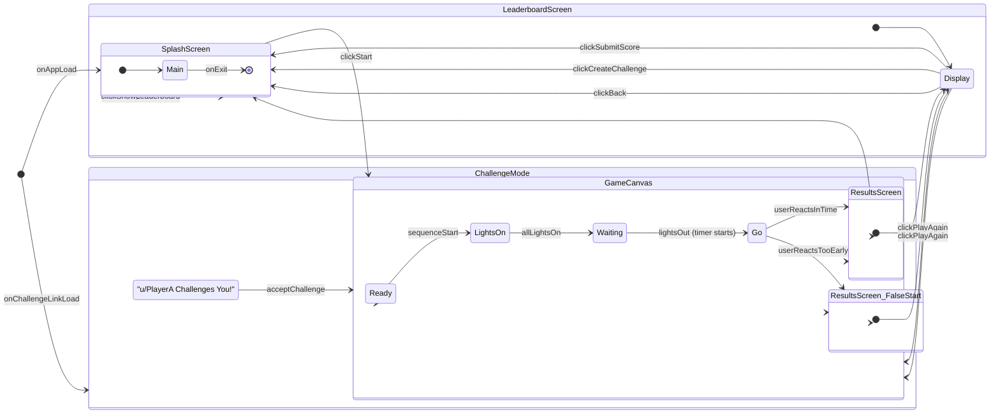

## 1. User Flow & State Machine Diagram

This document formally defines all possible application states and the user/system events that cause transitions between them. This ensures predictable application behavior and serves as a blueprint for the main state management logic.

We will use the [Mermaid syntax](https://mermaid-js.github.io/mermaid/#/stateDiagram) for clarity.

### Diagram



### Explanation of States & Transitions

- **`SplashScreen`**: The initial state of the application. The user can navigate to the main game (`GameCanvas`) or the `LeaderboardScreen`. All flows that end, such as submitting a score, return here.
- **`GameCanvas`**: This is a parent state representing the entire gameplay sequence.
  - **`Ready`**: The "READY..." text is shown. A system timer triggers the transition to `LightsOn`.
  - **`LightsOn`**: The lights are animating sequentially. A system timer triggers the transition to `Waiting`.
  - **`Waiting`**: All five lights are red. A randomized system timer triggers the crucial `lightsOut` event.
  - **`Go`**: The lights are out, and the application is actively listening for user input. This is the most critical state.
- **`ResultsScreen`**: Displays the user's successful reaction time and rating. From here, the user can choose to play again (looping back to `GameCanvas`), submit their score, or create a challenge (both returning to `SplashScreen`).
- **`ResultsScreen_FalseStart`**: A specific variant of the results screen shown after a false start. It offers fewer options (only "Play Again") as there is no score to submit.
- **`LeaderboardScreen`**: A view-only state for displaying high scores. The only action is to return to the `SplashScreen`.
- **`ChallengeMode`**: A special entry point triggered when the app loads from a challenge URL. It presents a unique "Accept Challenge" UI that funnels the user directly into the `GameCanvas`, bypassing the main `SplashScreen` flow initially.

---

## 2. Data & KV Store API Contract

This document specifies the exact data structures and function signatures for all interactions with Reddit's Key-Value (KV) Store. This creates a well-defined data access layer, ensuring consistent and predictable data handling throughout the application.

### A. Data Models (TypeScript Interfaces)

```typescript
/**
 * Represents a single entry in the leaderboard.
 */
export interface LeaderboardEntry {
  user: string; // Reddit username (e.g., "u/Speedy")
  time_ms: number; // Reaction time in milliseconds (e.g., 186)
  timestamp: string; // ISO 8601 UTC timestamp for filtering (e.g., "2025-10-25T10:00:00Z")
}

/**
 * Represents a stored challenge object.
 */
export interface Challenge {
  creator: string; // Reddit username of the challenger
  reaction_ms: number; // The challenger's time to beat
  seed: number; // The deterministic seed for the light sequence
}

/**
 * Defines the scope for leaderboard queries.
 */
export type LeaderboardScope = 'global' | `r/${string}`;

/**
 * Defines the time filter for leaderboard queries.
 */
export type LeaderboardFilter = 'Daily' | 'Weekly' | 'AllTime';
```

### B. API Service Definition

This defines the set of functions that the application UI will use to interact with the KV store.

```typescript
/**
 * A service class for managing all data interactions with the KV Store.
 */
export class KiroChallengeApiService {
  /**
   * Retrieves a filtered and sorted leaderboard.
   * @param scope - The scope of the leaderboard ('global' or a subreddit like 'r/formula1').
   * @param filter - The time filter ('Daily', 'Weekly', or 'AllTime').
   * @returns A promise that resolves to an array of LeaderboardEntry objects, sorted best-to-worst.
   */
  async getLeaderboard(
    scope: LeaderboardScope,
    filter: LeaderboardFilter
  ): Promise<LeaderboardEntry[]> {
    // Implementation will construct the KV key (e.g., "leaderboard:global")
    // and fetch the data. Filtering by date will be done on the client-side
    // after fetching the full "AllTime" list for that scope.
    // Returns empty array on failure or if no data exists.
  }

  /**
   * Submits a new score to the leaderboard for a given scope.
   * This function implements the "read-modify-write" pattern to handle concurrency.
   * @param scope - The scope of the leaderboard to submit to.
   * @param entry - The LeaderboardEntry object to add.
   * @returns A promise that resolves to true on success, false on failure.
   */
  async submitToLeaderboard(scope: LeaderboardScope, entry: LeaderboardEntry): Promise<boolean> {
    // Implementation will read the existing array, push the new entry,
    // sort, trim to the top 100, and write the entire array back.
  }

  /**
   * Creates a new challenge and stores it in the KV store with a TTL.
   * @param challengeData - The core data of the challenge to be stored.
   * @returns A promise that resolves to a unique challenge ID string.
   */
  async createChallenge(challengeData: { reaction_ms: number; seed: number }): Promise<string> {
    // Implementation will generate a UUID, create a Challenge object with the creator's
    // username, and save it to the KV store with a key like "challenge:<uuid>".
    // A TTL of 7 days will be set.
  }

  /**
   * Retrieves a specific challenge by its ID.
   * @param challengeId - The unique ID of the challenge to fetch.
   * @returns A promise that resolves to the Challenge object or null if not found.
   */
  async getChallenge(challengeId: string): Promise<Challenge | null> {
    // Implementation will fetch the data from the KV key "challenge:<challengeId>".
  }
}
```
